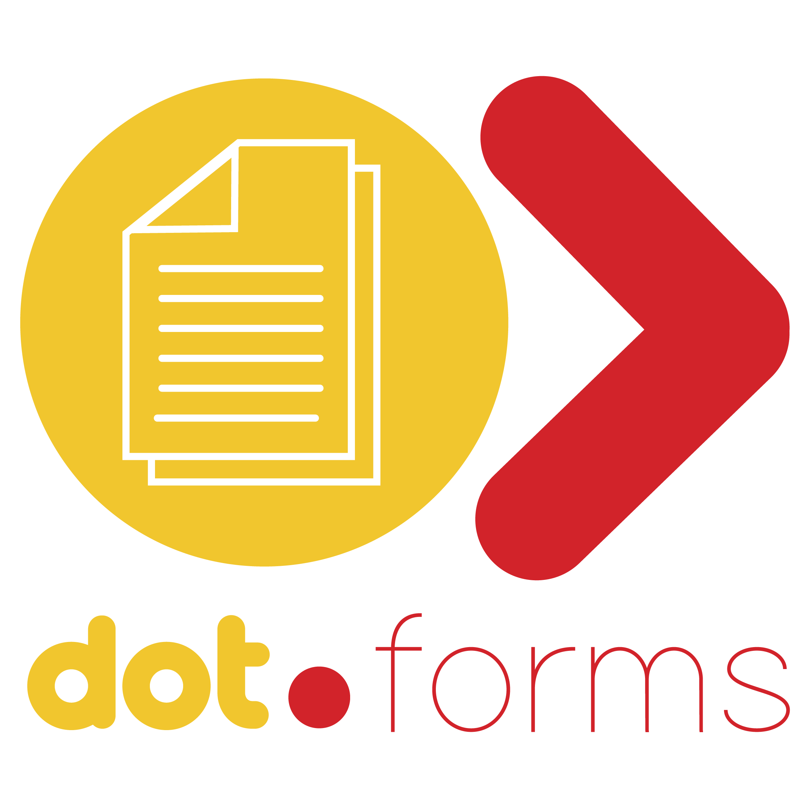

# Dot.Forms



Dot.Forms is an AI-powered, team-ready form platform built with Laravel 13, Livewire 3, and Jetstream Teams. It combines a visual form builder, public form publishing, submission analytics, and workflow integrations in one product.

## What Dot.Forms Includes

### Form Builder
- Drag-and-drop field ordering with a Livewire + Alpine experience.
- Field types: text, email, number, textarea, select, radio, checkbox, date, file.
- Field configuration for labels, placeholders, helper text, required state, and conditional logic notes.
- Draft and publish lifecycle with autosave.
- Version history with revert support.

### Public Form Experience
- Public URL publishing via form slug.
- Conversational mode support for step-by-step style forms.
- Theme controls (light, dark, brand), brand color, custom CSS, and custom logo upload.
- Configurable confirmation message.
- File upload handling for responses.

### Submission Management
- Submissions table with search and pagination.
- Dynamic column selection based on form fields.
- Submission detail modal view.
- Bulk delete for selected submissions.
- Data export options:
  - CSV export.
  - XLSX export (falls back to CSV when `zip` extension is missing).
  - User data export (JSON) for privacy/GDPR workflows.

### AI Capabilities
- AI form blueprint generation from natural-language prompts.
- AI field suggestions based on form context.
- AI label enhancement.
- AI validation assistance (field type and required rule suggestions).
- AI conditional logic suggestions.
- AI analytics over recent submissions (summary, sentiment, recommendations).
- Queue-aware AI jobs and configurable AI queue name.

### Team and Access Control
- Jetstream Teams integration.
- Team-level authorization via gates/policies.
- Per-form user roles: viewer, editor, owner.
- Collaboration visibility with active editor presence tracking.

### Integrations and Notifications
- Email notification on new submissions.
- Outbound webhooks for:
  - Generic webhook endpoint.
  - Slack webhook.
  - Zapier webhook.
  - Make webhook.
  - CRM webhook with AI-assisted field mapping (generic, HubSpot, Pipedrive).

### Security, Compliance, and Reliability
- Submission rate limiting.
- Honeypot spam trap.
- Minimum submit-time guard.
- Consent checkbox support.
- Data retention settings per form.
- Scheduled expiry handling for forms with close dates.
- Queue separation for notifications and AI workloads.

### Dashboard and Analytics
- Team-level analytics dashboard.
- Total submissions, completion rate, and average completion time.
- Recent daily trend data and top forms by submissions.

## Tech Stack

### Backend
- PHP 8.3+
- Laravel 13
- Laravel Jetstream (Teams)
- Laravel Fortify + Sanctum
- Livewire 3
- Laravel Queues

### Frontend
- Vite 8
- Tailwind CSS
- Alpine.js (through Livewire UX patterns)

### Data and Reporting
- SQLite by default (MySQL/PostgreSQL/SQL Server supported by Laravel)
- Laravel Excel (`maatwebsite/excel`) for CSV/XLSX exports

## Project Structure

```text
app/
  Console/Commands/           # Scheduled/utility commands
  Exports/                    # Submission export classes
  Jobs/                       # AI and async jobs
  Livewire/Dashboard/         # Dashboard features
  Livewire/Forms/             # Builder, public forms, submissions, AI modules
  Models/                     # Form, field, submission, version, suggestion, roles
  Notifications/              # Submission notifications
  Services/                   # AI and integration dispatch services
config/
  dotforms.php                # Dot.Forms-specific settings
database/
  migrations/                 # Schema for forms, fields, submissions, versions, roles
docs/
  ai-features.md              # AI feature details
  deployment.md               # Deployment guidance
resources/views/
  livewire/                   # Livewire blade templates
routes/
  web.php                     # Main app and public form routes
  api.php                     # API routes
  console.php                 # Scheduled commands
```

## Key Routes

### Authenticated App Routes
- `/dashboard`
- `/dashboard/analytics`
- `/teams/{team}/forms`
- `/teams/{team}/forms/{form}/builder`
- `/teams/{team}/forms/{form}/submissions`
- `/teams/{team}/forms/ai-builder`
- `/teams/{team}/forms/{form}/ai-suggestions`
- `/teams/{team}/forms/{form}/ai-analytics`

### Public Route
- `/forms/{slug}`

## Requirements

- PHP 8.3+
- Composer 2+
- Node.js 18+
- npm 9+
- Database supported by Laravel (SQLite recommended for local setup)

Optional but recommended:
- `zip` extension for XLSX export
- `gd` extension for broader image/file processing compatibility

## Quick Start

```bash
cp .env.example .env
composer install
npm install
php artisan key:generate
php artisan migrate
php artisan storage:link
npm run build
php artisan serve
```

In a second terminal (for frontend HMR during development):

```bash
npm run dev
```

Or run app + frontend together:

```bash
npm run dev-all
```

## Queue and Scheduler

Run queue workers:

```bash
php artisan queue:work --queue=notifications,ai,default --tries=3 --timeout=90
```

Scheduler command configured by the app:

- `forms:close-expired` (runs every minute)

For local scheduler testing:

```bash
php artisan schedule:work
```

## Environment Variables

Core app:

```env
APP_NAME=Dot.Forms
APP_ENV=local
APP_DEBUG=true
APP_URL=http://localhost
```

AI providers:

```env
OPENAI_API_KEY=
OPENAI_MODEL=gpt-4.1-mini
GEMINI_API_KEY=
```

Dot.Forms settings:

```env
DOTFORMS_TEAM_MAX_MEMBERS=10
DOTFORMS_TEAM_OWNER_ROLE=owner
DOTFORMS_UPLOAD_DISK=public
DOTFORMS_MIN_SUBMIT_SECONDS=2
DOTFORMS_QUEUE_NOTIFICATIONS=notifications
DOTFORMS_QUEUE_AI=ai
```

## Available Scripts

```bash
npm run dev       # Vite dev server
npm run dev-all   # Vite + php artisan serve concurrently
npm run build     # Production frontend build

composer dev      # Laravel serve + queue listen + logs + vite
composer test     # Clear config + run tests
composer setup    # Install + env prep + key + migrate + build
```

## Testing

Run test suite:

```bash
php artisan test
```

## Deployment Notes

Recommended production steps:

```bash
composer install --no-dev --optimize-autoloader
php artisan migrate --force
npm ci
npm run build
php artisan optimize
```

Then run:

- Queue workers for `notifications`, `ai`, and `default`.
- Scheduler (`* * * * * php artisan schedule:run`).

See full deployment details in [docs/deployment.md](docs/deployment.md).

## Related Documentation

- [docs/ai-features.md](docs/ai-features.md)
- [docs/deployment.md](docs/deployment.md)

## License

MIT License. See [LICENSE](LICENSE).
