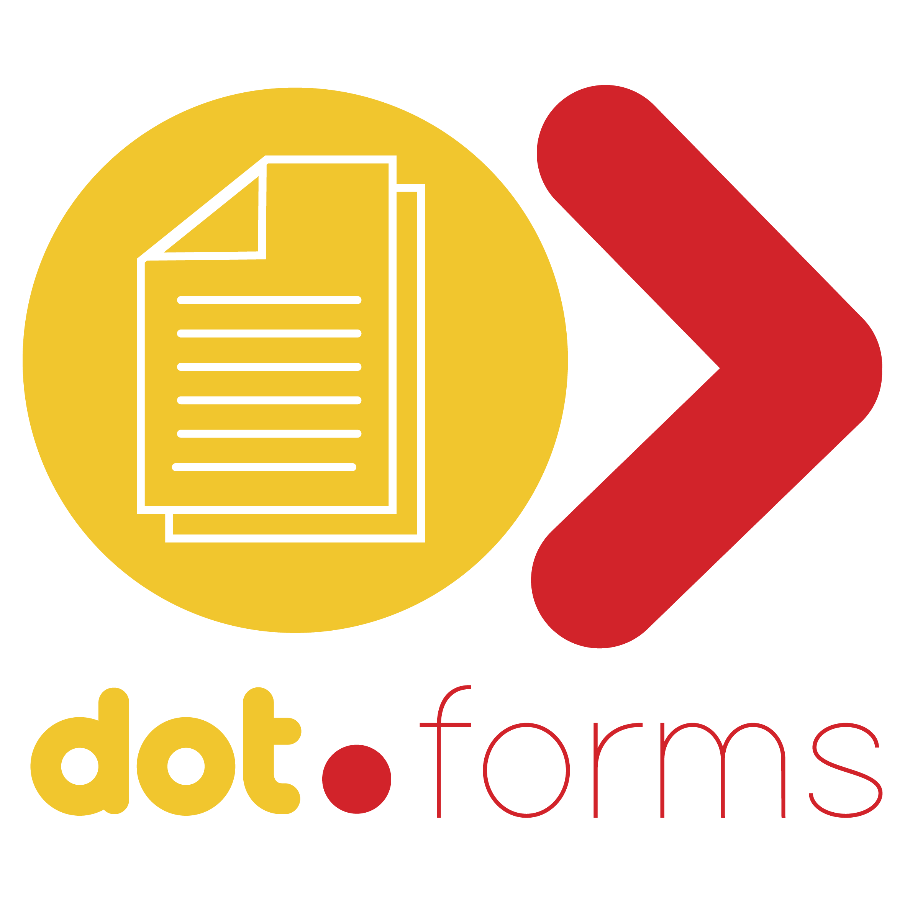

<div align="center">



<h1>Dot.Forms</h1>

<p>Powerful form builder and submission management — build, publish, and analyse forms without writing code.</p>

[](https://php.net)
[](https://laravel.com)
[](https://livewire.laravel.com)
[](https://postgresql.org)
[](LICENSE)

</div>

---

## Overview

Dot.Forms is the form builder platform in the Dot ecosystem. Build multi-page forms with drag-and-drop field configuration, publish them with a shareable link, and analyse submissions in a live dashboard — without touching code.

---

## Features

- Drag-and-drop form builder with 15+ field types
- Multi-page forms with conditional logic
- Shareable public form links with optional password protection
- Submission inbox with filtering, export (CSV/PDF), and webhooks
- Response analytics — completion rate, drop-off, field stats
- Email notifications on new submissions
- Full-text search across submissions
- Ecosystem SSO — authenticate from InfoDot with a single click

---

## Tech Stack

| Layer | Technology |
|---|---|
| Framework | Laravel 12 + PHP 8.4 |
| Frontend | Livewire 3 + Vite + Tailwind CSS |
| Auth | Jetstream 5 + Sanctum (ecosystem SSO) |
| Database | PostgreSQL 16 (shared infodot instance) |
| WebSockets | Laravel Reverb |

---

## Quick Start

```bash
git clone https://github.com/sakhileb/Dot.Forms.git && cd Dot.Forms
composer install && npm install
cp .env.example .env && php artisan key:generate
php artisan migrate && npm run dev & php artisan serve
```

```bash
bash bin/test.sh   # Run tests
```

---

## Part of the Dot Ecosystem

Dot.Forms connects to [InfoDot](https://github.com/sakhileb/InfoDot) — the central hub. Log in to InfoDot once and navigate here without re-authenticating via `/auth/ecosystem`.

---

MIT — © SK Digital / BluPin Incorporated
